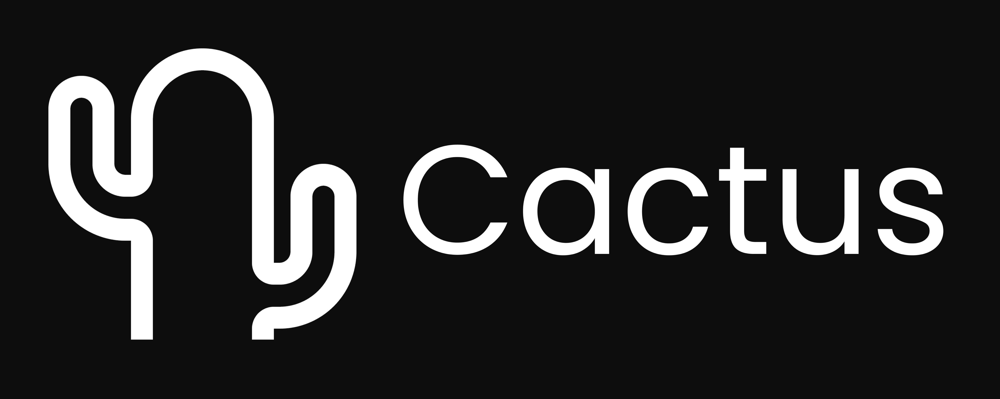

### A Rozenite plugin that provides comprehensive Cactus LLM inspection for React Native applications.

[![mit licence][license-badge]][license] [![npm downloads][npm-downloads-badge]][npm-downloads] [![Chat][chat-badge]][chat] [![PRs Welcome][prs-welcome-badge]][prs-welcome]

The Rozenite Cactus Plugin provides real-time LLM inspection + monitoring for Cactus-powered chatbots within your React Native DevTools environment. Track LLM + Embedding requests, token streaming, RAG retrievals, and performance metrics in real-time.

## Features

- **Real-time LLM Inspection**: Monitor Cactus LLM requests, responses, and streaming tokens
- **RAG Operations Tracking**: View retrieval-augmented generation operations with scores and sources
- **Performance Metrics**: Track latency, token counts, and operation timing
- **Event-Driven Architecture**: Stream events from your Cactus integrations automatically
- **React Native DevTools Integration**: Seamless integration with existing RN DevTools workflow
- **Type-Safe Event Handling**: Full TypeScript support for all event types and callbacks

## Installation

Install the Cactus plugin as a dependency:

```bash
npm install @rozenite/cactus-plugin
```

**Note**: This plugin requires Cactus libraries as peer dependencies. Make sure you have Cactus React installed:

```bash
npm install cactus-react
```

## Quick Start

### 1. Install the Plugin

```bash
npm install @rozenite/cactus-plugin cactus-react
```

### 2. Integrate with Your App

Add Cactus event emission to your React Native app - wrap your Cactus operations:

```typescript
import { postInspectorEvent } from '@rozenite/cactus-plugin';
import { CactusAgent } from 'cactus-react';

// Example: Initialize Cactus with event monitoring
const cactusAgent = new CactusAgent({...});

// Wrap your chat/rag operations
async function monitoredQuery(query: string, conversationId: string) {
  const requestId = `${conversationId}-${Date.now()}`;

  // Emit start event
  postInspectorEvent({
    kind: 'llm:start',
    requestId,
    model: cactusAgent.getModel(),
    params: cactusAgent.getConfig(),
    promptPreview: query.slice(0, 500),
    time: Date.now(),
  });

  try {
    const result = await cactusAgent.query(query);

    // Emit successful completion
    postInspectorEvent({
      kind: 'llm:end',
      requestId,
      totalTokens: result.usage?.total_tokens,
      latencyMs: Date.now() - (result.startTime || 0),
      finishReason: result.finish_reason,
      time: Date.now(),
    });

    // Emit RAG retrieval if available
    if (result.sources) {
      postInspectorEvent({
        kind: 'rag:retrieve',
        requestId,
        query,
        k: result.sources.length,
        sources: result.sources.map(s => ({
          id: s.id,
          title: s.metadata?.title,
          score: s.score,
          uri: s.metadata?.uri,
          preview: s.text?.slice(0, 240),
        })),
        latencyMs: result.searchLatency || 0,
        time: Date.now(),
      });
    }

    return result;
  } catch (error) {
    // Emit error event
    postInspectorEvent({
      kind: 'llm:error',
      requestId,
      message: String(error),
      time: Date.now(),
    });
    throw error;
  }
}
```

### 3. Access DevTools

Start your development server and open React Native DevTools. You'll find the "Cactus / RAG" panel displaying live LLM and RAG event streams.

## Advanced Integration

### Streaming Token Events

For token-by-token streaming, wrap your streaming handlers:

```typescript
// Create a streaming wrapper
function withStreamingInspection(requestId: string) {
  let chunkCount = 0;
  let fullResponse = '';

  return (token: string) => {
    chunkCount++;
    fullResponse += token;

    postInspectorEvent({
      kind: 'llm:chunk',
      requestId,
      delta: token,
      time: Date.now(),
    });
  };
}

// Use with Cactus streaming
const requestId = `stream-${Date.now()}`;
cactusAgent.streamingQuery(query, withStreamingInspection(requestId));
```

### Error Handling

Always wrap operations in try/catch to capture errors:

```typescript
try {
  await cactusAgent.embedDocuments(documents);
} catch (error) {
  postInspectorEvent({
    kind: 'llm:error',
    requestId: 'embed-operation',
    message: `Embedding failed: ${error.message}`,
    time: Date.now(),
  });
}
```

## Event Types

The plugin tracks these Cactus operations:

- **`llm:start`**: Request initialization with model, parameters, and prompt preview
- **`llm:chunk`**: Streaming token deltas (if streaming is enabled)
- **`llm:end`**: Request completion with latency, token counts, and finish reason
- **`llm:error`**: Failed requests with error messages
- **`rag:retrieve`**: RAG source retrievals with similarity scores and document metadata

## Data Privacy

The plugin automatically:
- **Truncates prompts** to first 500 characters to avoid sensitive data exposure
- **Limits source previews** to 240 characters per document
- **Only runs in development builds** (__DEV__ mode)
- **Gates all operations** behind development checks

## Usage Examples

### React Hook Integration

For React components, you can create custom hooks:

```typescript
import { useCallback } from 'react';
import { useCactusDevTools, postInspectorEvent } from '@rozenite/cactus-plugin';

function useMonitoredCactus() {
  // Initialize DevTools (optional)
  useCactusDevTools();

  const monitoredQuery = useCallback(async (query: string) => {
    const requestId = `query-${Date.now()}`;

    postInspectorEvent({
      kind: 'llm:start',
      requestId,
      model: 'cactus-model',
      params: { temperature: 0.7 },
      promptPreview: query,
      time: Date.now(),
    });

    return cactusAgent.query(query).finally(() => {
      // Emit end/error events here
    });
  }, []);

  return { monitoredQuery };
}
```

### Performance Monitoring

Track performance bottlenecks in your RAG pipeline:

```typescript
// Measure retrieval performance
const retrieveStart = performance.now();
const sources = await vectorIndex.search(query, { k: 5 });
const latencyMs = performance.now() - retrieveStart;

postInspectorEvent({
  kind: 'rag:retrieve',
  requestId,
  query,
  k: sources.length,
  sources: sources.map(s => ({
    id: s.id,
    score: s.score,
    title: s.metadata?.title,
    preview: s.text?.slice(0, 100),
  })),
  latencyMs,
  time: Date.now(),
});
```

## Made with ❤️ for the Cactus + Rozenite Ecosystem by Kyle Essenmacher

`@rozenite/cactus-plugin` is an open-source project that enhances the Cactus experience for React Native developers.

Contribute to the ongoing evolution of local LLM tooling!

## Links

- [Cactus Organization](https://github.com/cactus-compute/)
- [Cactus Core Library](https://github.com/cactus-compute/cactus)
- [Cactus React Integration](https://github.com/cactus-compute/cactus-react)
- [Rozenite DevTools](https://github.com/callstackincubator/rozenite)

[license-badge]: https://img.shields.io/npm/l/rozenite?style=for-the-badge
[license]: https://github.com/callstackincubator/rozenite/blob/main/LICENSE
[npm-downloads-badge]: https://img.shields.io/npm/dm/rozenite?style=for-the-badge
[npm-downloads]: https://www.npmjs.com/package/@rozenite/cactus-plugin
[prs-welcome-badge]: https://img.shields.io/badge/PRs-welcome-brightgreen.svg?style=for-the-badge
[prs-welcome]: https://github.com/callstackincubator/rozenite/blob/main/CONTRIBUTING.md
[chat-badge]: https://img.shields.io/discord/426714625279524876.svg?style=for-the-badge
[chat]: https://discord.gg/xgGt7KAjxv

#### License

By contributing to Rozenite, you agree that your contributions will be licensed under its MIT license.
